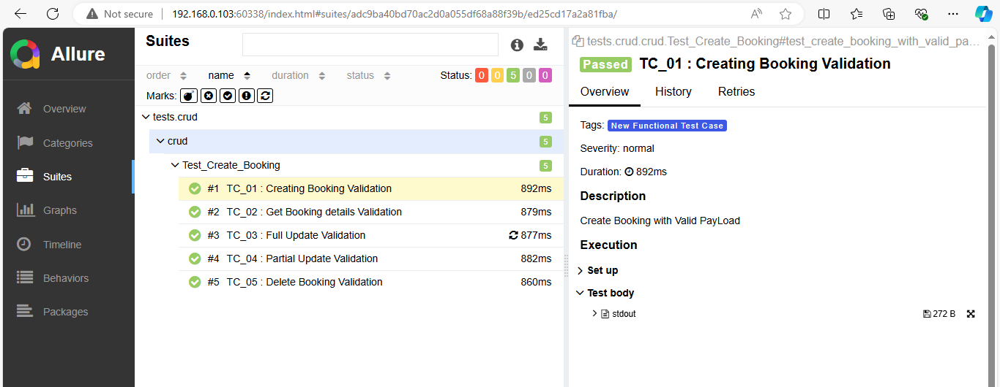

# Python API Automation Frame Work

# Tech Stack

-   Programming Language : Python 3.12
- Requests Module : HTTP
- Testing Framework : Pytest
- Reporting : Allure Report
- Test Data : csv,json,xml
- Parallel Execution : x distribute

# Install Package
```pip install requests pytest-html faker allure-pytest jsonschema```

# How to run tests parallel 
```pip install pytest-xdist```

# How to add git ignore file 
- Just copy the content from the below portal and paste it for gitignore file
- https://www.toptal.com/developers/gitignore/api/pycharm+all


# How To Run Test Case in Terminal
```pytest Tests/CURD/Creating_Booking_Validation.py --alluredir=Allure_Report -s```


# How to see Allure Report 
```allure serve Allure_Report```

